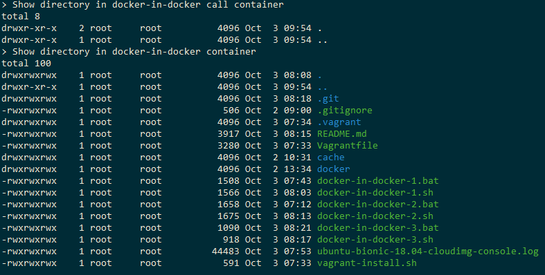
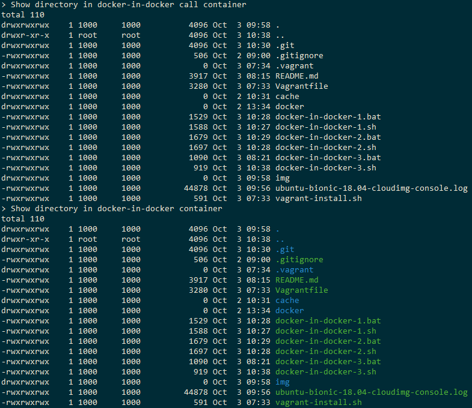

# Docker in Docker 技術研究

Docker-in-Docker 技術目前已知兩種方式：

1. 啟用任意容器並掛入本機 docker.sock 網址
2. 使用 Docker 官方提供的容器

這兩種方式概念不同，原理上前者只是將 Socket 物件掛載入容器，讓容器可以操控上層服務，後者則是設計透過 Docker 的封閉網路，創造出巢狀 Docker-in-Docker；此外後者是由 Docker 官方維護的容器，因此建議使用此方式來確保 Docker-in-Docker 的獨立性，且當前 Jenkins 官方說明亦採用此方式。
> [Using Docker-in-Docker for your CI or testing environment? Think twice.](https://jpetazzo.github.io/2015/09/03/do-not-use-docker-in-docker-for-ci/)

## 議題

本次研究專案，除完成 Docker-in-Docker 使用外，另外需針對一向議題進行多平台驗證與測試。

**『掛入當前容器內的目錄，再次掛給經由 Docker-in-DOcker 啟用的容器，將無法顯示目錄內容』**
> 此項議題主要發生於 Jenkins 實務時，為便於保存專案與緩存資訊而將 Jenkins 主要資訊掛載於目錄內，然而當 Jenkins Job 執行並藉由 Docker-in-Docker 啟用容器進行專案編譯時，卻發現掛入內容僅有目錄沒有相應程式碼。

## 研究與測試項目

### 1、Use Docker-in-Docker Demo

僅使用 Dokcer-in-Docker 容器驗證

+ Docker pull docker:binb
+ Docerk run docker:latest with -v %cd%
+ Inside docker, use docker run bash with -v ```/repo:/repo```

```
docker-in-docker-1.bat
```

#### 設計注意事項

+ Dockert 用來儲存印象檔、容器執行狀況應為封閉的掛載體 ```/var/lib/docker```
    - 設計原因可參考文獻 [docker-in-docker the ugly](https://jpetazzo.github.io/2015/09/03/do-not-use-docker-in-docker-for-ci/#docker-in-docker-the-ugly)
    - 此外若在 Windows 環境，該目錄指向本機目錄，會產生 overlay2 錯誤，說明為檔案不存在等。

### 2、Custom docker-in-docker controller

使用自行封裝的 Docker 服務的容器，並與 Docker:binb 存取服務

+ Docker pull docker:binb, and build docker image from ```./docker```
+ Docerk run docker:binb and custom-docker-control in them same network, and -v %cd% into control
+ Inside custom-docker-control, use docker run bash with -v ```/repo:/repo```

```
docker-in-docker-2.bat
```

### 3、Use docker.sock

使用自行封裝的 Docker 服務的容器，並掛入本機 ```var/run/docker.sock``` 來存取服務

+ Docker build docker image from ```./docker```
+ Docerk run custom-docker-control with -v %cd% and ```//var/run/docker.sock:/var/run/docker.sock```
+ Inside custom-docker-control, use docker run bash with -v ```/repo:/repo```

```
docker-in-docker-3.bat
```

### 4、TEST CASE 1、2、3 run at linux VM

由於本機為 Windows 環境，考量 Windows、Linux 環境差異，因此將啟用一個 Ubuntu 18.04 作業系統於 VirtualBox 中，並撰寫相同驗證項目於 Shell 腳本

+ 啟動並進入虛擬機

```
vagrant up
vagrant ssh
cd ~/git/research-docker-in-docker
```

+ 可執行腳本

```
sudo bash docker-in-docker-1.sh
sudo bash docker-in-docker-2.sh
sudo bash docker-in-docker-3.sh
```

## 小結

在完成[初步版本](https://github.com/eastmoon/research-docker-in-docker/commit/11db8cd4f31fcc5dadcfc8b29abd3c896ccc15d6)時，如議題所發生的情況，其結果如下圖所示。



在這結構設計下，不論任何案例，其結構都是區分為：

+ Daemon，實際提供 Docker 服務並保存相關快取 ( image、container etc. )
+ Control，實際執行 Docker 腳本與相關腳本操作服務

在這設計下需要掛載給 Docker 的目錄，是基於相關流程中的數個步驟，請託 Docker 進行處理 ( 編譯、壓縮、上傳 etc. )；然而就如前述結果，掛載的目錄並無法看到任何內容。

預想上有考慮幾個可能，目錄權限、目錄掛載方式、目錄同步速度、目錄資料流設定等，然而在 Daemon + Control 的容器下這狀況又未產生，對此提出了一項假設。

**『掛載目錄與快取屬於 Docker 下的 Volume 管理，其系統是依據 Daemon 可管轄的目錄來掛載。』**

基於這假設，便完成自今的更新，並得出如下圖結果：



如同預期，在 Windows Case 1、2 與 Linux Case 1、2、3，僅需使用 Daemon 的目錄或掛載目錄給此容器，便可正常讓 Docker-in-Docker 內容器取得正確的資料。
> Windows Case 3 因為無法將目錄路徑動態寫入，暫無修正方式。

## 參考

+ Docker-in-Docker with docker.sock
    - [Docker Tips : about /var/run/docker.sock](https://betterprogramming.pub/about-var-run-docker-sock-3bfd276e12fd)
    - [Control Docker containers from within container](https://fredrikaverpil.github.io/2018/12/14/control-docker-containers-from-within-container/)
+ Docker-in-Docker with offical image
    - [Docker in Docker!](https://hub.docker.com/_/docker)
    - [Running Docker in Docker on Windows (Linux containers)](https://tomgregory.com/running-docker-in-docker-on-windows/)
    - [Docker Privileged - Should You Run Privileged Docker Containers?](https://phoenixnap.com/kb/docker-privileged)
+ [[Docker] 瞭解 Docker 的預設網路設置](https://mileslin.github.io/2019/05/%E7%9E%AD%E8%A7%A3-Docker-%E7%9A%84%E9%A0%90%E8%A8%AD%E7%B6%B2%E8%B7%AF%E8%A8%AD%E7%BD%AE/)
    - [IPTables Flush: Delete / Remove All Rules On RedHat and CentOS Linux](https://www.thegeekstuff.com/2011/01/redhat-iptables-flush/)
    - [Bridge network driver](https://docs.docker.com/network/drivers/bridge/)
+ [dockerd](https://docs.docker.com/engine/reference/commandline/dockerd)
    - [Daemon configuration file](https://docs.docker.com/engine/reference/commandline/dockerd/#daemon-configuration-file)
    - [Configuring DNS](https://dockerlabs.collabnix.com/intermediate/networking/Configuring_DNS.html)
